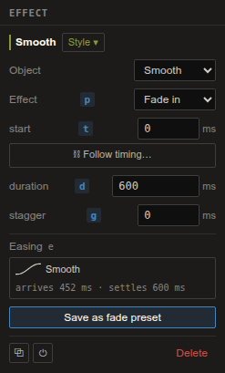
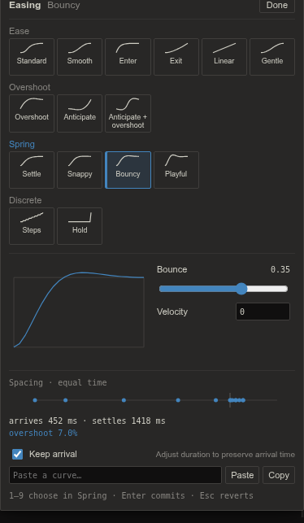

Slide turns project content into talks. A project can hold several **decks**; each deck is a
filmstrip of slides you compose on a stage — and the stage *is* the
[figure editor](figure.qmd): the same tools, the same Inspector, the same
[live plots](../concepts/semantic-plots.qmd). Anything you can do to a figure, you can do to a
slide; figures travel between the two worlds without translation.

# Decks and the filmstrip

The deck list sits above the filmstrip: create (**+ New deck**), duplicate, or remove decks —
each is one readable file in the project. The filmstrip shows live thumbnails: drag to
reorder, duplicate or delete from a thumb, **+ Add slide** for a new slide (layouts seed
starter text — title, section, two-column, or *blank* for a clean stage), and **+ Preset**
inserts a slide from your machine-global **slide preset library** (save any slide there from
the Slide panel — its animation, background, and media travel with it).

The right rail switches between **Object**, **Animation**, **Slide**, and **Deck**. Object edits the selected object; Animation edits the selected effect. The **Slide panel** holds the name, per-slide **background**, transition, speaker
notes. The **Deck panel** controls the **theme** — seven built-ins from *Flux Dark* through *Flux
Light*, *Paper*, *Midnight*, *Slate*, *Sepia*, and *Contrast* — and the **stage size** (16:9,
4:3, 16:10). **Ctrl+Shift+B** hides the whole rail, and both rails resize by dragging their
inner edge (the filmstrip too; **Ctrl+B** hides it when no text is selected).

# Steps and editing destination

A presentation is a sequence of named **steps** (called beats in the deck file and commands).
**Start** is the initial presentation frame. Each later step runs **On click**, **With previous**,
or **After previous** with a chosen delay. The step strip always stays visible while the timeline
shows the selected step's effects.

The bar above the stage states where your edits go:

- **Design** edits the original slide objects. Future hand-off destinations stay hidden until
  landing; **Show hidden** makes them available as faint, selectable ghosts. Unborn ghost copies
  remain absent even with Show hidden enabled.
- **Edit after step N** shows the evaluated result through that step. Move, resize, recolor,
  rewrite, or restyle an object to create or update a Change at **that exact step**. Earlier
  steps remain intact. Adding, deleting, grouping, and renaming objects are structural slide edits.

Selecting a different step browses its effects; it does not silently change the editing destination.
Choose **Edit after step N** when you want to shape the newly selected step. **Show hidden** displays
objects and plot parts that have disappeared as faint, selectable ghosts. Turn **Show hidden**
off to remove them completely from the editing canvas, selection, and snapping, so you can work
on objects underneath them. Turn it back on whenever you need to edit a hidden object or add
an **Appear** effect at a later step. This changes only your editing view; it does not delete
objects or change presentation/export. **Fit** keeps the whole stage visible as you resize the dock and rails;
manual zoom or pan preserves your chosen view instead.

# The Animator

**Animate ⏱** opens a resizable dock with a named step strip, millisecond ruler, and timing lanes.
Object and semantic-part names stay readable in the fixed left column, even for short effects.
Select a lane to select and outline its stage target. Hovering a lane outlines the exact object or
plot parts. Selecting an object identifies its effects in the current step.

To animate something, select it on the stage (**Ctrl/Cmd+click** drills to a plot part), then use:

- **Appear** / **Ctrl+Shift+A** — add an entrance.
- **Transform ▾** — one action, three ways: **Change** (**Ctrl+Shift+C**) shapes a new state of the
  object at this step; **Ghost…** (**Ctrl+Alt+G**) creates copies that transform independently;
  **Become** (**B**) turns the object into another one. See [Transforms](#transforms).
- **Emphasize** — add a highlight.
- **Disappear** / **Ctrl+Shift+D** — add an exit.

Text rises in, shapes pop, and lines and paths draw on. Adding another appearance keeps the existing
effects; successive effects on the same target start after its existing effects by default.
**Auto-animate** builds a plot's entrance sequence from its semantic anatomy and the plot's own
hints: axes and their colour key first, then gridlines, then the data (lines draw on, bars grow from
their baseline, points and hexagons stagger in), and last the legend, annotations and brackets,
each after the short delay the plot suggests. A multi-panel plot offers **panel by panel**: the
same four phases for each panel in turn (an inset right after its host), with the figure's title
first and its shared legend last.

Drag a box from empty timing-grid space to select the effects it intersects. Hold **Shift**
(or Ctrl/Cmd) to add to the selection. Crossing a collapsed group span selects its members.
Scroll while dragging, or hold near the grid edge to scroll; **Escape** cancels the selection.
Click empty grid space to clear it. Selection alone does not change timing or add an Undo entry.

Drag a timing bar to change its start, its right edge to change duration, or drag it vertically to
reorder. Drag onto a step to move it; hold **Alt** to copy between steps. Shift or Ctrl/Cmd-click
selects several lanes; **Ctrl/Cmd+A** selects this step's effects. **Ctrl/Cmd+G** groups the selection,
**Ctrl/Cmd+Shift+G** ungroups it, and **Ctrl/Cmd+D** duplicates it. Groups can collapse without changing
timing. Double-click a group name to rename it; drag its span to retime or move the whole group. Right-click a lane for these actions and moves to named steps. Ctrl/Cmd-wheel zooms timing;
**fit ⟲** restores automatic scaling. The ruler and its vertical grid lines fill the whole
visible time axis at every zoom, even past the step's last effect; while you drag, a guide follows the edge you are moving and runs the full
height of the ruler when it snaps to another effect's edge or to a grid line — every major and
minor line drawn is a snap target (the 50 ms round-number grid still catches drags between
them), and a resize snaps the effect's *end* onto the line — and a single
selected effect shows its start and end across all lanes so alignment reads at a glance.

## Align starts and ends

Select effects and press **Alt+A** to align their starts, or **Alt+D** to align their ends —
the same keys align objects left and right on the canvas. Press again to step through the
choices, nearest first: with several effects selected whose edges differ, the first press lines
them up with the selection's own earliest start or latest end; after that each press moves them
to the start or end of the next lane *above* the selection, and after the last one the
effects return to where they were. A full-height line and a ruler label (**→ ‹rect 2› end ·
1.95 s**) show what each press aligned to. With four effects under a 1 s draw-on and a
0.95 s rise starting at 1 s, **Alt+D** ends them at 1.00 s, again at 1.95 s, and a third time
restores them.

Aligning moves each effect and keeps its duration. Add **Shift** (**Alt+Shift+A**,
**Alt+Shift+D**) to resize instead: the opposite edge stays put. The presses of one cycle are a
single **Undo**. A moved start detaches a [Follow timing](#follow-timing) link, as a drag does,
and the toast names the former lane. **Align starts** and **Align ends** are also on a bar's
right-click menu. `align-tracks` does the same from the CLI and MCP:

```bash
flux align-tracks talk slide1 --tracks e3,e4,e5 --edge end --to rect2      # rect2's end
flux align-tracks talk slide1 --tracks e3,e4 --edge start --to 250 --resize  # starts at 250 ms
```

## Inherit an effect's animation

To give several effects exactly the animation of another one, select them, hold **Ctrl+Alt**
(**⌘+⌥** on macOS) and drag one of their bars onto the other effect's lane. The bars stay where
they are; a dashed line runs from the selection to the pointer, the lane under it lights, and a
label reads **Inherit from ‹rect 2›**. Release to apply; release anywhere else or press
**Escape** to cancel. The effects keep their own start times unless you hold **Shift** as you
release, which copies the start too. One **Undo** reverts the whole drop, and a toast names
what was inherited (**4 effects inherit ‹rect 2› · 953 ms · spring**). **Inherit animation
from…** on a bar's right-click menu does the same with one click on the source lane.

Inherit copies the source's duration, easing or spring and stagger. Between two entrances (or two
exits, or two transforms) the effect itself and its options come too — four pops become four
rises. Across kinds only the timing travels, so an exit stays an exit. If the source uses an
[animation style](#animation-styles), the effects link to that style instead and follow its
later edits. What the effects animate, their transform endpoints, links, groups and on/off state
never change. Video commands and animations do not share timing. `inherit-track` is the
CLI and MCP twin:

```bash
flux inherit-track talk slide1 --from rect2 --to e3,e4,e5,e6 [--include-start]
```

The **X-ray** (**Alt+R**) animates too: select one plot — or several — press **Alt+R**, pick
the rows you want (**Shift+click** a run, **Ctrl/Cmd+click** to toggle, **Ctrl/Cmd+A** for all;
a multi-plot X-ray lists the parts every plot shares), then press **M** and choose
**Appear**, **Emphasize**, **Disappear** or **Change**. Appearance actions give each picked part
its own effect on the current step, ready to retime. **Change** selects the whole owning objects;
part-style edits are captured in each plot’s Change. Selecting the same part through
both a common row and its plot's tree creates one effect. With **Show hidden** off,
disappeared targets remain untouched by common-row visibility and animation actions.

The **Animation** inspector edits the selected effects' target, part, effect, start, duration,
easing, stagger, and relevant specialized controls. Mixed timing values are blank until you set
one shared value. Choose a new target or part to repair a missing binding. An issue banner identifies
missing targets, unmatched parts, unsupported effects, or conflicting overlapping effects; click an
issue to inspect its track. The **Easing** field shows the timing curve and opens its editor.
**Library** holds reusable presets and multi-track templates.

Keyboard commands belong to the focused surface. In the animation dock or inspector, **Delete**
removes effects, arrows navigate steps/lanes, **Alt+left/right** retimes starts,
**Alt+Shift+left/right** adjusts durations, and **Alt+A** / **Alt+D** align starts / ends.
**Ctrl+Alt-drag** a bar onto another lane to inherit its animation. On the canvas, Delete removes objects and arrows move
them. **P** focuses Effect/Action, **D** Duration, **T** Start/Offset, **G** Stagger, and **E**
opens Easing. Inputs retain normal text editing; **Ctrl/Cmd+Z** undoes one edit or gesture.

## Easing and springs

Select an effect and click **Easing**, or press **E** while the Animator has focus.
The field shows the curve, when the motion first arrives at 90% of its travel, and when it
settles. A faint curve inside each timeline bar shows the same timing; springs also have an
arrival tick.



Choose a tile from **Ease**, **Overshoot**, **Spring**, or **Discrete**. Hover a tile for one
preview pass; reduced motion keeps that preview still. Focus a group and press **1–9** to
choose within it. **Bouncy** is a spring with overshoot and a settling tail. Adjust
**Bounce** to change its character and **Velocity** to change its starting speed. For a Discrete
curve, **Steps** sets the count from 1 to 60. The **overshoot …%** readout reports how far the
curve passes its endpoint; data and other bounded channels still stay within their limits.



**Keep arrival** starts checked. It adjusts each selected effect's duration to preserve its
arrival time as you change the curve, within 150–4000 ms. A 600 ms Smooth move becomes about
1418 ms with Bouncy: the motion arrives at the same time and the bar grows to hold the settling
tail. Turn Keep arrival off to keep the bar's duration instead. A follower anchored to the bar's
end waits until settling finishes.

The graph's handles edit a custom bezier. Arrow keys move a focused handle by 0.01;
**Shift+arrow** moves it by 0.1. The numeric fields let you enter exact values. Existing
influence curves keep their handles horizontal; dragging vertically converts them to a free
bezier. The spacing chart shows 13 positions at equal times: close dots mean slower motion.

Use the **Paste a curve…** field and **Paste** button, or **Ctrl+V** in the editor, to enter
names such as `bouncy`, or strings such as
`spring(0.35, v=2)`, `cubic-bezier(.2,1.4,.4,1)` and `steps(8)`. **Copy** copies the current curve.
Invalid text shows an error without changing the effect. Different selected curves show
**Mixed**; choosing a curve applies to all selected effects as one edit. **Enter**, **Done**,
or clicking outside commits; **Esc** restores the opening curve and duration.

**Data never overshoots.** Box movement and camera motion can spring past their destinations;
data values, count-up text, plot views, opacity and reveals stay within their valid range.
**PowerPoint uses Morph's own ease**; Flux's curve is retained in Flux playback and HTML exports.

Right-click a timeline bar and choose **Copy timing**, then select other effects and choose
**Paste timing**. This copies duration, curve and stagger together as one undoable edit.
It leaves their targets, start times and linked style identities in place.

## Animation styles

Deck animation styles share an effect's preset, parameters, duration, easing, stagger, arc and
start. A linked effect inherits absent fields; changing a field on that effect overrides the
style for that field. Editing the style updates every inheriting effect. An effect links only to
a style of its own kind (appearance, transform or video command); linking gives it the style's
preset, and changing the style's preset changes it on every linked effect. Detaching a style,
or deleting it, keeps each effect's current settings. Saved slide presets carry the styles
they use, and insertion reuses an existing style with the same name and family.

Select an effect and open **Style ▾** in the Animation inspector. Choose a deck style of the
same family, or **Save as new style…** and enter a name. Selecting several effects links them
all; a selection spanning different families explains why linking is unavailable.


A local edit shows **override** beside **↺ use style**. Reset removes that field's override
so it follows the style again. Setting stagger to zero turns it off for this effect. Setting
both custom influence values to zero in the editor resets the timing field to its style or
preset default. A stored zero-influence record can explicitly suppress inherited influence,
but the editor’s zero action restores inheritance. **Edit style…** opens the shared
fields under an **Editing style ‹name› · N tracks** banner; **Back to effect** returns to local
edits. **Detach** keeps the current settings as independent values.


Right-click a timing bar and choose **Animate like…**, then click an object on the canvas.
The picker's outline and hover show which object you are on and name its effect in this step;
one click commits.
Its effect in this step supplies the style. If it has no style, Flux creates **Like ‹object
label›** and links both effects. A multi-selection links in bulk; incompatible families are
reported. In the X-ray, **6** arms the same pick for the selected objects or parts. **Esc** cancels.

The animation **Library** keeps its usual copy action on the preset name. **as a linked style**
creates a deck style from that saved preset and links the applied effects. Slide presets include
the deck styles they use and restore their links when inserted.

## Follow timing

Hold **Ctrl/Cmd** and drag a bar's **left edge** onto another bar's start or end. The magnet
guide turns solid; releasing creates a timing anchor with zero offset. A link glyph marks the
follower. Retiming the source moves its followers live, including the source's stagger tail.
You can also choose **⛓ Follow timing…** in the inspector and select a lane's start or end.


An anchored start row reads **after ‹lane› end + 0 ms** and displays the resolved start.
Its primary input edits the **offset**. Choose **⛓ Detach** to retain the resolved start as
absolute milliseconds. A plain bar drag also detaches and names the former lane in a toast;
one Undo restores the whole gesture. Missing targets, cross-step references and cycles show
the compiler's issue text with the stored start as fallback.

The CLI and MCP support this through `anim-style`, `animate-like` and `set-track`:

```bash
flux anim-style create talk --name "Gentle reveal" --family appearance --preset fade --duration 400
flux set-track talk slide1 effect1 --style STYLE_ID
flux animate-like talk slide1 --from effect1 --to effect2,effect3
flux set-track talk slide1 effect2 --anchor effect1:end:50
```

The last command starts effect2 50 ms after effect1 ends, including its stagger tail.
Retiming effect1 moves effect2 automatically. Anchors stay within one step; self-links and
cycles are refused. A removed anchor target leaves a visible issue and uses the follower's
stored start. `set-track --start` adjusts an anchored effect's offset; `--no-anchor` keeps its
current resolved start. `--no-style` detaches its style. A start cascade adjusts anchor offsets;
a duration cascade writes local overrides on linked effects.

Successive appearance effects follow the prior effect's end. Plot Auto-reveal links the
Data-phase geometry to the points' start plus its original half-stagger delay.

## Playback and inspection

**Step** plays only the selected step. **Play** starts from that step and continues through the slide;
**Slide** plays the whole slide. **Space** toggles play/pause and **Stop** returns to editing. The
playhead follows the actual player clock. Drag the ruler to inspect a precise time without editing
the document or changing the edit destination. Playback retains the last frame for inspection.
**Loop** repeats the chosen playback range. Editing a property cancels the old preview so the next
preview uses the updated document. Use Present for manual click-by-click rehearsal.

## Appearances

The preset menu covers entrances (**fade**, **fadeRise**, **popIn**, **growBaseline**,
**drawOn**, **writeOn**), exits (**fadeOut**, **popOut**, **drawOff**, **wipeOut**), emphasis
(**highlight**, **dim**), **stagger** — members of a group or points of a series arrive in
sequence, ordered by position or index, from either end or the center — and **countUp**, which
tweens a number in a text element ("n = 1,247" counts up in place). Draw-on/off expose full
**trim path** control (direction, anchor, single/both-ends/middle-out, partial windows), and
wipes pick their direction.

**by** orders the ramp: **order** (target order), **x →** or **y ↑** (data position), **value**
(each part's own value — a hexagon's mean, a cell's value, a bar's height — low to high),
**count** (observations per hexagon) or **data index** (the generator's index). The order comes
from the plot's data, so a hexmatrix can fill from its emptiest hexagon to its fullest.

Use **Stagger → Each** for the delay between ranks, or **Total** for the time between the
first and last item starting. Switching modes preserves the current span. **From → Random**
uses a repeatable order; edit **Seed** or click **↻** to reshuffle (one Undo restores it).
The distribution curve controls how densely starts fall within the span: an ease-out curve
starts widely spaced, then packs later starts together. Springs are clamped to the span.
Center and Edges keep symmetric pairs together; if every item ties, Total uses input order.
A single target has no stagger tail.

```bash
flux set-track talk slide1 effect1 --stagger-total 800 --stagger-curve enter --stagger-from random --seed 42
flux set-track talk slide1 effect1 --stagger-each 30
flux set-track talk slide1 effect1 --stagger-each 30 --stagger-by count
```

## Transforms {#transforms}

Every object can be **transformed** at a step in exactly three ways. They share one lane kind in
the timeline (**Transform · Change**, **Transform · Ghost**, **Transform · Become**), one set of
timing and easing controls, and the same rules: one transform per complete source target per step
(a whole object or a particular part set), chained across steps, with the **Before** / **After** buttons choosing which endpoint you edit.

### Change

A **Change** tweens an object into a different version of itself. Choose **Transform ▸ Change**
(or **Ctrl+Shift+C**) and its **After** state appears on the canvas. Use the ordinary editor tools
to shape it; the animator records a sparse property change. **Before** selects the immediately
previous step (or Design for the first change), while **After** selects this step. The destination
above the stage always identifies where subsequent edits will go. Chained changes compose across
steps; colors blend perceptually and rewritten numbers digit-tween. Drop a captured property in the
Animation inspector's **Δ** row to let it inherit from earlier steps.

**Rewriting text** plays a *text morph*. Words the old and new text share glide from where
they were to where they land, even when they change order, case or style; a word that grows
into a longer one (*quick* → *quickly*, *Microscope* → *Microscopy*) glides and gains its new
letters on the way. Everything else fades: old letters drift down and fade in reading
order while the new ones rise in, so the line turns over left to right without ever going
empty. Crossing words pass on slightly separated lanes, and a size, weight or colour change
travels with each word. A rewrite of more than 200 characters moves line by line. A change
of a single number still counts up in place.

For a box move, the **Arc** slider bends the path to either side of the straight line.
Zero keeps it straight; the endpoints stay fixed. The small path preview shows the bend.
Arc shares the transform's easing and can be inherited from an animation style.

```bash
flux set-transform talk slide1 step1 object1 --state '{"x":420,"y":160}' --arc 0.5
```

### Ghost

**Transform ▸ Ghost…** creates independent copies that move out from an object. For example,
one arrow can split into three arrows pointing to three new results.

1. Select the source object and the step where the copies should appear, then choose
   **Transform ▸ Ghost…**.
2. Choose the number of copies (1–32; initially 3) and whether the original should **Stay**,
   **Disappear**, or **Transform** too.
3. Create the ghosts. Flux selects the first copy in **Edit after step**. Move, resize,
   rotate, restyle, or edit it with the ordinary tools to set its destination — or make it
   **Become** something else (below).
4. Use the copy selector and Previous/Next controls to edit the other copies, even while
   they overlap. **Add copy** adds another destination; **Select original** returns to the source.
5. Play the step. Each copy begins at the original's state at the end of the preceding step
   and moves to its own destination. Adjust each lane's delay, duration, and easing normally.

Ghosts are identical copies when they start; they have normal opacity unless you change it.
Changes to the original in earlier steps update their starting state. A transform of the original
in the same step runs independently. The copies remain available for further animations in later steps.

Before their creation step, ghosts are absent, including with **Show hidden** enabled. Use
**Edit destination** to return to the step where a selected ghost can be edited. Deleting a
ghost's creation lane removes that copy and its later effects; Undo restores them together.

### Become

**Transform ▸ Become** (or just **B** with something selected) makes an object
become another object or part of a plot. Select the source first. To start from plot parts,
**Ctrl+click** a part or pick several rows in the **X-ray** before arming Become.

Choosing Become enters the **Become picker**, a temporary mode. The slide wears a soft green
outline, the canvas around it dims slightly, the source gets a dashed green outline, and the bar
above the canvas names what is waiting (**‹Rect› becomes…**). Nothing is moved or edited while
picking: every click on the canvas is a pick.

- **Hover** outlines the finest thing under the pointer: a single point, bar, box, tick or
  label of a plot, or one member of a group. The bar names it exactly as its timeline lane will,
  with the point's data where it has one.
- **Click** picks it. Picking is always multi-select: keep clicking to add more, and click a
  picked thing again to remove it. Picks wear a solid green outline (a ring around round marks),
  numbered in picking order when there are few of them; the bar lists them as chips
  (**6 points · W1**, **2 ellipses**) that you can remove with ×.
- **Drag** anywhere on the stage to draw a box: it picks everything **fully inside**. Data marks
  win over ticks and labels; a whole object inside the box is picked whole. **Alt+drag**
  removes what it encloses.
- **Alt+click** picks the whole plot or group instead of the part. **A** widens the last pick to
  its siblings: the other members of its group, then the same part of every series, then the
  rest of its series. **Backspace** drops the last pick.
- **Double-click** picks something and confirms at once, the quick path for a single object.
- **Space**, **Enter** or the **Become** button confirms. **Escape** or **Cancel** leaves the picker
  without creating a transform and puts the source selection back. Changing slides or steps also
  cancels.
- **Add mode** lets the source become something that does not exist yet. Press a drawing tool
  key (**R** rect, **O** ellipse, **L** line, **P** pen, **T** text), **Ctrl+P** for a preset or
  **Alt+G** for a gallery plot, or choose from **Add ▾** on the bar. The outline gains an inner
  dashed line and the editor works as usual: everything you draw or insert joins the pick.
  **Enter** or **Done** returns to picking with those objects picked; **Escape** also returns,
  and a second **Escape** cancels.
- **X-ray**: hover a plot and press **Alt+R**. Rows you select join the pick and rows you clear
  leave it, live on the canvas; points picked on the canvas stay picked. Axis rows include their
  spine, ticks and labels; expand them to choose only the spine. **Space** (or **B**) in the X-ray
  confirms the whole pick, and closing the X-ray keeps it.

- **Several things at once.** Pick several things and the source becomes **all of them**: three
  loose ellipses, parts of two different plots, or a mix of shapes and plot parts. Your layers stay
  as they are; there is no need to group anything first (**Alt+click** a grouped object to pick its
  whole group). The source's outline splits into one piece per destination, and each piece lands
  exactly on its own object. The lane and the Destination row name the set (**Rect → 3 ellipses**)
  and list its members; a set cannot be swapped — author the reverse hand-offs from each object.

A loose drawn destination between whole objects uses **Consume**: its appearance becomes the source's After state
and the destination is removed. The source keeps its identity; one Undo restores both.
Plots, images, groups and part sets use a **hand-off**: both objects stay in the slide,
with the destination hidden before landing and the source hidden afterwards. For example,
a drawn chevron can become a plot's X and Y axis spines, or a box on a plot can become a
rectangle. The canvas lands in **Edit after step**, with the track selected in the
**Animation** inspector. **Show hidden** lets you inspect hidden objects as faint ghosts.
Video clips cannot take part; use Change to move or resize them. Groups and sets of several
objects can be destinations; choose one object or plot parts as the source. A set always hands
off: **Consume** and **↔ Swap direction** need a single destination.

To work from the other end, select the destination object or plot parts (or several objects,
which then appear together from one source) and choose **Appear ▾ → Appear from…**. The main
**Appear** button still adds a normal entrance. The same picker opens and the bar names what
**appears from…**; pick its source and confirm with **Space** or **Enter**, or double-click it. Pick
**several** sources and they **merge**: each hands off into the destination in the same step, early
pieces hold in place, and the destination appears when the last one lands (one Undo removes them all).
In the X-ray, **m**, then **5** (**Appear from…**) starts this same flow from the picked
rows. Both routes create exactly the same hand-off.

**Merge many into one.** With **Appear from…** armed on one object, **Shift+click** several
sources and press **Enter**: each source gets its own hand-off into the same destination, in
one Undo. The destination is shared out among them (the reverse of becoming a set), the
pieces converge, and the destination appears when the last of them lands. A piece that
arrives early waits in place. Each source keeps its own lane, so you can stagger them.

**Pair** chooses how the outlines match: **auto**, **by position**, **by order**, **by data**,
or **tile**. Connected strokes, such as two axis spines, form one path. Order follows point
indices; tile divides one outline among its partners. By data lands points at their values
on the destination axis. This supports **data ↔ summary**: points can become a distribution,
or a summary can expand back into its points. Unmatched sources fade out; unmatched
parts of the destination fade in. Images crossfade while their boxes move.

**Text and shapes.** When a shape becomes text, it splits into one piece per letter, in
reading order, and each piece pours into its letter's outline. When text becomes a shape,
the letters fuse into it. A text that becomes another text plays the text morph described
under Change, whether by Consume or by hand-off. Letter outlines come from the font
installed on your computer, and an exported presentation carries the outlines of the
letters it needs. When no outline is readable, the letters land as rounded boxes and then
fade into the text, and the Animation inspector reports it. This happens with the bundled
Gelasio typeface or in a browser preview without the desktop app.

After a hand-off to some of a plot's parts, when the plot has no appearance effects yet,
the toast offers **Auto-animate the rest…**. It adds the plot's remaining build phases after
the landing, excluding the leaves already revealed by the hand-off. A hand-off to the whole
plot already reveals every part, so it offers no remainder.

**Destination.** The Animation inspector names both sides of a hand-off; for a set it reads,
for example, “hands off to 3 ellipses” and lists each member below. **Pair ▾** chooses
auto, by position, by order, by data, or tile; **Reveal** chooses flip or draw.
**Method ▾** chooses what a filled shape's interior does while its outline splits into several
pieces (or several pieces merge into it): **shatter** splits it into wedges that fly with the
pieces; **dissolve** fades it away in place as the outline leaves; **collapse** shrinks it into
the shape's centre; **drain** empties it toward where the pieces are going (and fills from that
side when pieces merge). Shatter is the default.
**↔ Swap direction** reverses the hand-off, including plot parts, in one Undo. It keeps timing,
styles and follower links. It refuses ghost births, group sources, missing outlines and a
destination that already has a transform in this step. The command twin is `swap-become`.
For whole loose objects, **Consume instead** asks for a second click before removing the
destination. **Auto-animate the rest…** builds the destination plot's remaining parts after
the hand-off; like the toast, it appears only for a hand-off to some of the plot's parts.
**Become** picks a different destination for this effect.

With a whole plot as the source, **From gallery…** keeps its frame and changes its content
to another project plot. **Data from gallery…** and **Keep own data** in the Animation
inspector edit or remove that content target. Shared supported series tween in data space;
a series without a tweenable counterpart fades on its own, and only an SVG without semantic
IDs crossfades as a whole. A Become at a step with an existing Change replaces that
same target's endpoint; a ghost can Become something at its birth step.

From the command line or an agent, `become` can name destination parts with `--part` and
source parts with `--source-part`. A destination set is `--to <id>` repeated, or
`--members` with a JSON list of objects and their parts; `appear-from --members` is its twin. Plots, images and part sets use **hand-off** by default:
the source hides after landing and the destination stays on the slide. Whole drawn objects
use **Consume**, which replaces the source and removes the destination; `--mode` chooses
either completion for whole objects. `appear-from` authors the same hand-off from the
destination's side. `--pair` chooses how outlines match, `--reveal` chooses flip or draw, and
`--method` chooses shatter, dissolve, collapse or drain for a filled shape's interior.
See the [slide command reference](../../resources/flux-context/SLIDES.md) for syntax.

**Alt+G** opens the same [Plot gallery](figure.qmd#getting-plots-in) used by Figure.
Preview sizes, spacing and names are adjustable, and **Pin open** keeps the gallery in a
separate window for repeated insertion onto the active slide.

### Camera: Zoom vs Fly

**Zoom** adds a camera move toward the selected object; **Reset** pulls back to the full slide.
When plot parts are drilled, **Zoom** frames their combined outline instead of the whole plot.
After-step editing uses the same camera mapping, so selection, dragging, and highlights stay aligned.

Select a camera track in the Animator to choose **Path: Zoom | Fly**. **Zoom** is the default:
the view expands or contracts about a fixed point, at a constant proportional zoom rate before
easing. With no zoom change, it pans in a straight line. **Fly** pulls back for a long pan,
travels, then moves in toward the destination. Its **suggested … ms** hint shows a duration
based on the distance and zoom change; click **Apply** to use it. You can still edit duration
and easing yourself.

Release note: existing zooming camera tracks now use the geometric Zoom path. Their mid-flight
frames change; their start and end views are identical. There is no legacy-path switch.

### Axis view: data-space transforms

**Axis view** edits a plot's data view, which records its x/y limits and linear or log scales. A Change of this view
zooms, pans or rescales the data inside the plot; the plot's position and size can change at
the same time. A ghost can therefore float away while zooming into a smaller data range.
A saved view also applies in Figure mode, Paper embeds and exports.

Lines, points, bars, heatmap cells, hexagons, contour bands and box or violin bodies move
through the new axis mapping. During the glide the existing ticks, gridlines and tick labels
move with their data values and fade near the edges; at rest the viewed axis is re-ticked for its
new limits (categories, dates and fixed labels keep their own ticks). A log view requires
positive limits and positive data; an unsupported series keeps its original geometry and the
animation reports why. Images and rasterized layers keep their geometry. A twin value axis
(fluxplot 0.3.2 `y2` / `x2`) has its own limits in the view.

A plot needs a manifest with series and calibrated axes. Unsupported axes stay disabled with
a reason. Select a plot and use **Axis view** in the Object inspector, or **x view** / **y view** in
its **F** menu. Enter limits in data units; empty fields use the generated limits shown as
placeholders. Choose **linear** or **log**, or **Reset** both axes. At **After step N** the
edit becomes a Change on that step, with one undo per edit. Scrubbing previews the axis glide.
X-ray's axis-row **v · Axis view…** focuses the matching Inspector row.

Ticks exactly on a new limit fade to zero (the outer 4% rule). Non-series marks, such as a
dashed reference line, stay put. For multi-panel plots the same view applies to each panel;
placeholders show the first panel's limits.

Asset Becomes and Changes of a data view use the same projection, so one Change may combine
new data, axis limits and movement. Shared semantic parts tween; removed parts fade out in
the first 40% and added parts fade in during the last 40%. Between two versions of a plot whose
members carry stable keys (fluxplot 0.3.2: bars by category, heatmap cells and hexagons by row
and column), each member tweens to its namesake — a bar grows or shrinks to its new height, a
hexagon's colour passes through the colour scale's law at the intermediate value — so a bar
chart or a hexmatrix with new data is a Become candidate even without lines or points. A local SVG structure change fades
that part. An SVG without semantic IDs uses a whole-plot crossfade. Matching ignores positional
ids (matplotlib's numbered `ytick_7`-style ids and Flux's stamped ones), so a tick keeps its
identity when a regenerated plot renumbers them, and the last frame is the new plot exactly.

The CLI/MCP twin is **set-plot-view** / **set_plot_view**:

```sh
flux set-plot-view figure1 plot1 --x-min 0 --x-max 10
flux set-plot-view talk/slide1 plot1 --y-min 1 --y-max 100 --y-scale log --beat beat2
flux set-plot-view talk/slide1 plot1 --reset --beat beat3
```

The figure form saves the view on the object. A deck/slide target without `--beat` edits the
Design object; with `--beat`, it writes a Change's `state.view` at that step, preserving other
changed properties and inheriting earlier limits. `--reset` restores the generated axes.

### Plots follow the deck theme

A plot saved by fluxplot 0.3.1 or later tags every piece of its scaffold — tick labels, titles,
ticks, spines, gridlines, backgrounds — with the theme token it was drawn in. On a slide the
plot **follows the deck theme** by default: its ink takes the theme's text colour, its axes the
muted text, its gridlines a faint mix of text into the background, and its backgrounds turn
transparent, so a plot saved on white reads on *Flux Dark* without a regeneration. Data colours
never change. **Follow deck theme** in the Object inspector turns it off for one plot (a plot
whose white ground is the point). Copies of the plot in Figure mode and Paper keep their generated
ink: there is no deck theme to follow there.

### Colour scale: recolouring in data units

A colour-mapped plot saved by fluxplot 0.3.1 or later carries **Colour scales**, element state
like the axis view: the palette, its direction, the norm kind, the limits and `extend`. A Change
of a colour scale repaints every coloured element and the key's gradient and ticks through the
data values, so one step can narrow a heatmap's range, switch a hexbin to a log scale or swap its
colormap while the plot moves. Limits glide (log limits in log space), a new palette blends table
by table, a changed norm kind switches at the midpoint. A saved scale also applies in Figure mode,
Paper embeds and exports.

Select the plot and edit **Colour scales** in the Object inspector. At **After step N** the edit
becomes a Change on that step, with one undo per edit; scrubbing the Animator previews the glide.
A scale drawn as one raster image cannot recolour live and reports itself.

The CLI/MCP twin is **set-plot-color-scale** / **set_plot_color_scale**;
**get-plot-color-scales** / **get_plot_color_scales** lists a plot's scales, what may change
and the live view a figure, a Design or a step holds:

```sh
flux set-plot-color-scale figure1 plot1 --cmap crameri.batlow --vmax 20
flux set-plot-color-scale talk/slide1 plot1 --norm log --vmin 1 --vmax 100 --beat beat2
flux set-plot-color-scale talk/slide1 plot1 --reset --beat beat3
flux set-plot-color-scale figure1 plot1 --scale rates --cmap magma --regenerate
flux get-plot-color-scales talk/slide1 plot1 --beat beat2
```

**set-series-color** / **set_series_color** gives a whole series one colour on a slide's Design
(`flux set-series-color talk/slide1 counts '#205ea6' --element plot1`), and **View as…** in the
toolbar previews the stage as a colour-deficient audience sees it (see the Figure chapter).

The figure form saves the scale on the object; `--regenerate` also writes the complete
`__fluxplot__` control into the recipe, re-runs it, refreshes the figure and clears the live
edit. A deck/slide target without `--beat` edits the Design object; with `--beat` it writes
`state.colorScale` at that step, inheriting earlier edits. `--scale` names the scale when a
plot has several; omitted fields are preserved and `--reset` restores the generated scale.

## Cascading tracks

Select several tracks and press **Ctrl+Alt+C**: the same [cascade](figure.qmd#cascade)
popover, over animation — stagger **start**, **duration**, **per-item or total stagger**, **Arc**, or easing
**influence** or **Spring bounce** in even steps across the selection. Spring bounce skips
non-spring effects, which do not consume a step. Five drawOns starting 120 ms apart is one
gesture, not arithmetic.

# Presenting

**F5** presents from the start (**Shift+F5** from the current slide). Arrow keys and **Space**
advance beats (**Shift+arrows** jump whole slides), a typed **number + Enter** jumps to a
slide, **B**/**W** blank to black/white, **S** shows presenter notes, **F** toggles
fullscreen without leaving, **R** resets the timer, and one **Escape** leaves, even in
fullscreen. Click zones work too: left quarter back, elsewhere forward.

# 3D models

Drop a binary **GLB** onto the slide, or import a **3D fluxplot** saved from Python.
Keep its `.fluxplot.json` beside the GLB to retain named mesh parts, colorbars, legends,
value fields and shape states. Models use the same **3D view** and **Appearance** controls
as Figures. **From file** shows the mesh's colors; **Uniform** uses one chosen fill.

Double-click a model to orbit. Enter accepts the view and Escape cancels it. In **Design**,
this changes the original camera. In **Edit after step N**, it writes that step's Change
endpoint; the original view stays available. Picking a Become destination temporarily
blocks orbit and tells you why, so a drag cannot accidentally change both actions.

Select a model and choose **Turntable** to add a full, constant-speed turn. It is an ordinary
Change effect: edit its duration or combine it with a Shape change. If the step already has a
Change for that model, Turntable joins it and sets its timing to 6 seconds, linear, and Flux
tells you when that re-times it. Complete turns remain complete turns, even when the starting
and ending views look identical. Zoom changes smoothly in proportion, and projection changes
at the endpoint.

For a scene with shape states, use the **Shape** sliders or **Frame** scrubber at the desired
editing destination. To reveal a named mesh or furniture part independently, select it in
**X-ray** and use **Animate selected**. Orbit, shape, colors and part visibility travel with
the slide and use the same playback in Present and portable HTML.

**Ghost** creates independent views that share the same mesh. While you pick a Become
destination, the pick bar shows **Vertex morph** for a compatible pair and **Crossfade**
otherwise, and the Animation inspector's Destination row repeats it; hover either for the
reason. A vertex morph needs the same mesh structure: matching mesh pieces, triangles and
vertex order. Export both shapes together or use fluxplot's shared-topology workflow. A
crossfade is a valid result, not an animation issue. Hand-off keeps both objects and reveals
the destination at landing. A mesh part cannot start a Become (it has no outline to fly); use
the whole model, or its labels and axes. A Become **into** a mesh part crossfades in place:
the source fades out while the part fades in over the effect's duration, so the part never
pops in at landing. A model cannot become one of its own parts; use **Appear** on the part
instead. Consume replaces the source's content and removes the
destination in one undoable edit. To replace a model's mesh in the same frame, choose
**Model from gallery…** in the Animation inspector (or **From gallery…** on the pick bar);
**Keep own content** drops that choice.

HTML and MP4 preserve the moving model. PDF and PowerPoint export a **Design-view still**,
shown and placed where each build step leaves it, with only the parts and labels that step
shows (a part that appears later is absent from earlier pages); PowerPoint does not contain an
editable 3D object. Command-line exports and a portable HTML deck's stills follow the same
rule. If a GLB is missing, Flux shows a placeholder and refuses to save an incomplete deck:
restore the named file or remove the model. A WebGL fallback is a still or placeholder with an
issue, not a simulated animation.

Whole-slide presets explicitly embed model bytes for another project. Their picker uses a
saved preview. Newer or mismatched metadata remains preserved and inactive. In the rare
case that importing prepared bytes would silently activate previously inactive metadata,
insertion refuses and asks for a matching re-export; the saved preset stays unchanged.

# Video clips

Keep **`.mp4` and `.mov`** files in **`plots/_videos`**. Open **Plots & videos** in Slide mode (or press **Alt+G**),
choose a clip by its poster thumbnail, and import it onto the current slide. Drag, resize,
rotate, group, and duplicate it with the same tools used for images. The inspector includes
**Muted** and **Loop** options. Imported clips keep their originals; the deck stores a
compatible MP4 playback copy and a poster frame. Longer imports show progress and can be cancelled.

A clip starts on its poster frame. **Appear** reveals it, and **Start video** begins playback.
These are separate actions: put Appear on step 1 and Start video on step 2 to show the poster
first, then start the clip on the next advance. They can also share a step. Playback continues
while the presenter waits between steps. **Pause video** holds the current frame;
**Stop video** returns to the poster. **Start video** always restarts from the beginning.
The command's start offset controls when it runs within its step.

Preview and Present support pausing video after a step's animations finish. Leaving a slide,
blanking the presentation, or hiding the player pauses its media. Portable HTML includes the
clips and audio; a browser that requires a gesture for sound shows a **Play video** button.
Continuous MP4 export includes moving clip frames and mixes unmuted audio. The last active
clip finishes before the final hold; looping clips end with the export's configured timeline.
Video clips belong to Slide mode; Figure canvases continue to support static content.

# Export

**Export ▾** offers these formats, each written to the project's `exports/`:

- **HTML** — **one self-contained `.html`** with every slide, beat, animation, transform, and
  font, playing in any web browser with the same keys as Present mode. No Flux on the
  presenting machine, no network, nothing to install: open the file, give the talk.
- **PDF** — one page per slide, showing the slide with every build step applied: a handout or
  a copy to send before the talk (`<deck>.pdf`). Plots and text stay sharp at any zoom.
- **PDF, each step** — one page per build step, so a slide that reveals three things becomes
  three pages (`<deck>-steps.pdf`).
- **PowerPoint** — an editable `.pptx` (`<deck>.pptx`) that **plays your builds and
  transitions** in PowerPoint's slide show. Text arrives as real text boxes (bold, italic,
  colour, superscript and subscript kept), and rectangles, ellipses, lines, arrows and drawn
  paths as real PowerPoint shapes you can restyle. Plots arrive as **vector** pictures:
  right-click one and choose **Convert to Shape** (**Group ▸ Ungroup** in older versions) to
  edit its individual lines, points and labels.
- **PowerPoint, final state** — the same, but one PowerPoint slide per slide with every build
  step applied and no animation (`<deck>-final.pptx`): the easiest file to edit further.

**How builds play in PowerPoint.** PowerPoint's **Morph** transition tweens every object that
appears under the same name on two consecutive slides, so it can carry what Flux animates —
moves, Changes of size, colour or text, the camera, entrances and exits. A slide with builds
becomes its resting state plus **one PowerPoint slide per click**, each entered by Morph over
the effect's duration:

- effects that play one after another within a click become extra slides that advance by
  themselves after the same gap; an **auto** step advances after its delay; steps chained
  **with previous** land on the same click;
- entrances and exits fade; **Rise in** and **Pop in** keep their lift or pop, and **Pop
  out** its shrink;
- the slide's transition (fade, slide, push) plays when the slide is entered.

Objects are named with a leading `!!` (the Selection Pane shows it) — that is how Morph pairs
them across slides, so keep the names if you edit a build. Morph uses its own ease, so a
step's easing, arc paths and eased stagger distribution are not copied; a plot whose parts build in cross-fades from one state to the
next, and a count-up cross-fades from its first number to its last. Morph needs PowerPoint 2019
or Microsoft 365; older versions show a plain fade.

Pages and slides are exactly the stage's shape; PowerPoint slides are the standard 13.33-inch
width. Videos show their poster frame in PDF and PowerPoint, and PDF pages show where
animations end. Fonts that are not installed on the other computer (such as Gelasio) are
replaced by PowerPoint.

**Video…** exports the **current slide** and all of its animation steps as one continuous
`.mp4`. Set **Delay between steps**, **Hold at start**, and **Hold at end**, then choose
where to save. Defaults are a 0.5-second step delay, a 1-second start hold, a 2-second end
hold, and **1080p at 60 fps**. Settings are remembered for the next export.

The start hold sets when the first animation begins. Later manual steps use your chosen
delay; **with previous** steps play together, and **automatic** steps keep their authored
delay. Animation durations, easing, Becomes, ghost copies, text changes and camera
motion come from the same player used by Present. The video begins from the slide's
initial design regardless of the step you are editing.

Choose 720p, 1080p or 2160p, and 30 or 60 fps. The slide's aspect ratio is preserved
(portrait slides work too); the displayed pixel dimensions show the exact output size.
MP4s use H.264 with AAC audio from unmuted clips. Individual timing holds can be 0–60 seconds; a
single-slide video can be up to 30 minutes long. Static slides export as a still video.

Flux saves the slide before export and renders a snapshot in the background. You can keep
editing while progress is shown, or **Cancel export**. An existing MP4 is replaced only
after its replacement finishes successfully. **Show in folder** reveals the completed file.
Export warnings identify missing assets or animation issues that also need attention in
the slide. Video export is available in the desktop app.

The CLI uses the same exporter (timings here are milliseconds):

```bash
flux export-slide-video <deck-id> <slide-id> --out slide.mp4 \
  --step-delay 500 --start-hold 1000 --end-hold 2000 --height 1080 --fps 60
```

# Between figures and slides

**Send to deck…** (in Figure mode's Inspector) turns a figure into a slide;
**Send to canvas…** (in the Slide panel) turns a slide into a paper figure — it becomes
citable as `@fig-…` like any other. Copied composition is independently editable. Plot source data stays linked unless you deliberately freeze a usage; later source refresh preserves your slide-specific layout.

Decks remember the accepted intrinsic size of linked assets so regeneration preserves the
same placement scale whether the deck stays open or is reopened later. An older deck without
that baseline adopts the currently accepted size once; Flux cannot reconstruct dimensions
that were never saved.

# Embedding a slide in a document

In [Paper](paper.qmd), choose **Insert slide…** or type **/slide**, then select this deck
and a slide. The document keeps a live reference. Renaming, reordering, and saved edits
update the linked block; playback begins at step 0 and advances one step per click.

Deleting a referenced slide or removing its deck lists the affected documents, including
open unsaved documents, before you can choose to proceed. Deleting a block in Paper does
not delete the source. HTML exports retain manual playback; PDF and Word show step 0.

# Troubleshooting

| Symptom | Cause → fix |
|---|---|
| The animation chords do nothing | The animator is closed → open it with **Animate ⏱** first |
| A plot Become fades a series instead of morphing its data | Continuous data motion requires shared series ids, supported data and matching axis scales. A series without a tweenable counterpart fades on its own (the Animation inspector lists it); only an SVG without semantic IDs crossfades as a whole. |
| An animation issue appears | Select the issue to inspect the effect, then retarget missing objects/parts or adjust overlapping timing |
| A shape becomes text and the letters land as boxes ("No readable outlines for …") | The text's font has no outline Flux can read: Gelasio, the bundled theme font, ships only as a web font; a browser preview has no access to installed fonts → set the text in an installed font (Georgia, Arial, …) to see letter outlines; the boxes still land on each letter and fade into the text |
| "Couldn't open that deck — its file may be missing or corrupt." appears while an agent edits the deck | An older Flux mistook a reload overtaken by the agent’s next edit for a bad file → update Flux; the deck on disk is intact, so reopening it shows the agent’s version |
| Present shows placeholder "Title / Subtitle" text | The slide was created with a starter layout → delete the starters, or use the *blank* layout when composing by hand |
