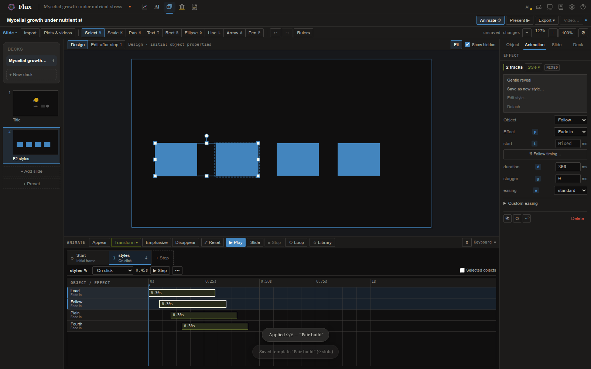
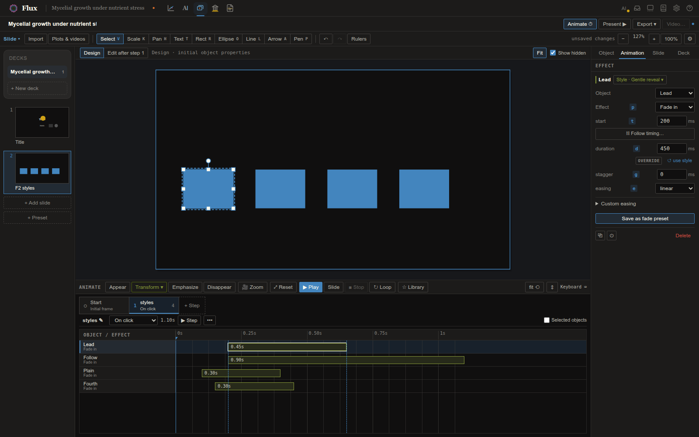
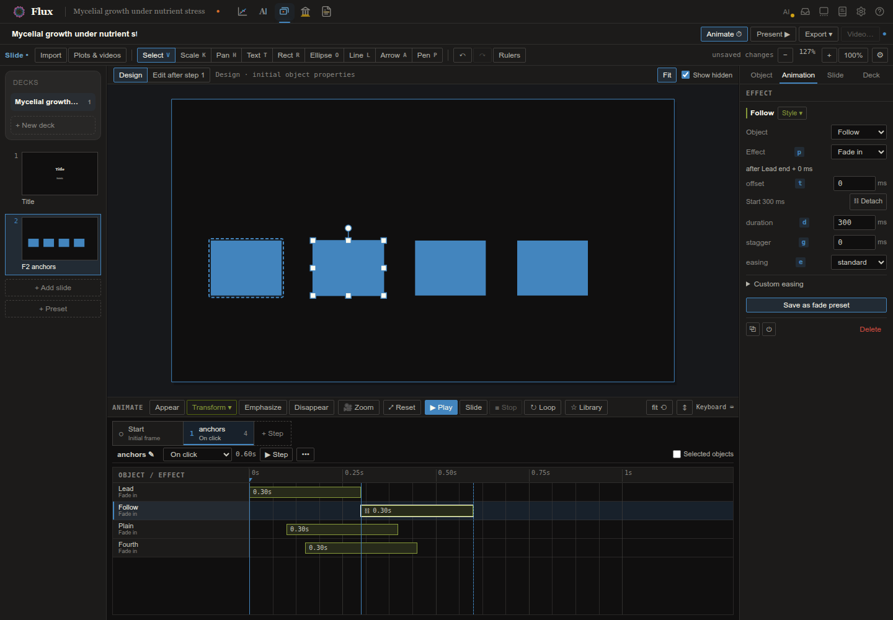

Slide turns project content into talks. A project can hold several **decks**; each deck is a
filmstrip of slides you compose on a stage — and the stage *is* the
[figure editor](figure.qmd): the same tools, the same Inspector, the same
[live plots](../concepts/semantic-plots.qmd). Anything you can do to a figure, you can do to a
slide; figures travel between the two worlds without translation.

# Decks and the filmstrip

The deck list sits above the filmstrip: create (**+ New deck**), duplicate, or remove decks —
each is one readable file in the project. The filmstrip shows live thumbnails: drag to
reorder, duplicate or delete from a thumb, **+ Add slide** for a new slide (layouts seed
starter text — title, section, two-column, or *blank* for a clean stage), and **+ Preset**
inserts a slide from your machine-global **slide preset library** (save any slide there from
the Slide panel — its animation, background, and media travel with it).

The right rail switches between **Object**, **Animation**, **Slide**, and **Deck**. Object edits the selected object; Animation edits the selected effect. The **Slide panel** holds the name, per-slide **background**, transition, speaker
notes. The **Deck panel** controls the **theme** — seven built-ins from *Flux Dark* through *Flux
Light*, *Paper*, *Midnight*, *Slate*, *Sepia*, and *Contrast* — and the **stage size** (16:9,
4:3, 16:10). **Ctrl+Shift+B** hides the whole rail, and both rails resize by dragging their
inner edge (the filmstrip too; **Ctrl+B** hides it when no text is selected).

# Steps and editing destination

A presentation is a sequence of named **steps** (called beats in the deck file and commands).
**Start** is the initial presentation frame. Each later step runs **On click**, **With previous**,
or **After previous** with a chosen delay. The step strip always stays visible while the timeline
shows the selected step's effects.

The bar above the stage states where your edits go:

- **Design** edits the original slide objects. All authored objects are available for arranging.
- **Edit after step N** shows the evaluated result through that step. Move, resize, recolor,
  rewrite, or restyle an object to create or update a Change at **that exact step**. Earlier
  steps remain intact. Adding, deleting, grouping, and renaming objects are structural slide edits.

Selecting a different step browses its effects; it does not silently change the editing destination.
Choose **Edit after step N** when you want to shape the newly selected step. **Show hidden** displays
objects and plot parts that have disappeared as faint, selectable ghosts. Turn **Show hidden**
off to remove them completely from the editing canvas, selection, and snapping, so you can work
on objects underneath them. Turn it back on whenever you need to edit a hidden object or add
an **Appear** effect at a later step. This changes only your editing view; it does not delete
objects or change presentation/export. **Fit** keeps the whole stage visible as you resize the dock and rails;
manual zoom or pan preserves your chosen view instead.

# The Animator

**Animate ⏱** opens a resizable dock with a named step strip, millisecond ruler, and timing lanes.
Object and semantic-part names stay readable in the fixed left column, even for short effects.
Select a lane to select and outline its stage target. Hovering a lane outlines the exact object or
plot parts. Selecting an object identifies its effects in the current step.

To animate something, select it on the stage (**Ctrl/Cmd+click** drills to a plot part), then use:

- **Appear** / **Ctrl+Shift+A** — add an entrance.
- **Transform ▾** — one action, three ways: **Change** (**Ctrl+Shift+T**) shapes a new state of the
  object at this step; **Ghost…** creates copies that transform independently; **Become…**
  (**Ctrl+Shift+E**) turns the object into another one. See [Transforms](#transforms).
- **Emphasize** — add a highlight.
- **Disappear** / **Ctrl+Shift+D** — add an exit.

Text rises in, shapes pop, and lines and paths draw on. Adding another appearance keeps the existing
effects; successive effects on the same target start after its existing effects by default.
**Auto-animate** builds a plot's entrance sequence from its semantic anatomy.

Drag a box from empty timing-grid space to select the effects it intersects. Hold **Shift**
(or Ctrl/Cmd) to add to the selection. Crossing a collapsed group span selects its members.
Scroll while dragging, or hold near the grid edge to scroll; **Escape** cancels the selection.
Click empty grid space to clear it. Selection alone does not change timing or add an Undo entry.

Drag a timing bar to change its start, its right edge to change duration, or drag it vertically to
reorder. Drag onto a step to move it; hold **Alt** to copy between steps. Shift or Ctrl/Cmd-click
selects several lanes; **Ctrl/Cmd+A** selects this step's effects. **Ctrl/Cmd+G** groups the selection,
**Ctrl/Cmd+Shift+G** ungroups it, and **Ctrl/Cmd+D** duplicates it. Groups can collapse without changing
timing. Double-click a group name to rename it; drag its span to retime or move the whole group. Right-click a lane for these actions and moves to named steps. Ctrl/Cmd-wheel zooms timing;
**fit ⟲** restores automatic scaling. Vertical grid lines run through every lane at the
ruler's ticks; while you drag, a guide follows the edge you are moving and runs the full
height of the ruler when it snaps to another effect's edge or to the 50 ms grid, and a single
selected effect shows its start and end across all lanes so alignment reads at a glance.

The **X-ray** (**Alt+R**) animates too: select one plot — or several — press **Alt+R**, pick
the rows you want (**Shift+click** a run, **Ctrl/Cmd+click** to toggle, **Ctrl/Cmd+A** for all;
a multi-plot X-ray lists the parts every plot shares), then press **A** and choose
**Appear**, **Emphasize**, **Disappear** or **Change**. Every picked part lands on the current
step as its own effect, ready to retime in the timeline. Selecting the same part through
both a common row and its plot's tree creates one effect. With **Show hidden** off,
disappeared targets remain untouched by common-row visibility and animation actions.

The **Animation** inspector edits the selected effects' target, part, effect, start, duration,
easing, stagger, and relevant specialized controls. Mixed timing values are blank until you set
one shared value. Choose a new target or part to repair a missing binding. An issue banner identifies
missing targets, unmatched parts, unsupported effects, or conflicting overlapping effects; click an
issue to inspect its track. Custom influence is under **Custom easing**; selecting a named easing
returns control to that curve. **Library** holds reusable presets and multi-track templates.

Keyboard commands belong to the focused surface. In the animation dock or inspector, **Delete**
removes effects, arrows navigate steps/lanes, **Alt+left/right** retimes starts, and
**Alt+Shift+left/right** adjusts durations. On the canvas, Delete removes objects and arrows move
them. Inputs retain normal text editing; **Ctrl/Cmd+Z** undoes one edit or gesture.

## Animation styles

Deck animation styles share an effect's preset, parameters, duration, easing, stagger and
start. A linked effect inherits absent fields; changing a field on that effect overrides the
style for that field. Editing the style updates every inheriting effect. An effect links only to
a style of its own kind (appearance, transform or video command); linking gives it the style's
preset, and changing the style's preset changes it on every linked effect. Detaching a style,
or deleting it, keeps each effect's current settings. Saved slide presets carry the styles
they use, and insertion reuses an existing style with the same name and family.

Select an effect and open **Style ▾** in the Animation inspector. Choose a deck style of the
same family, or **Save as new style…** and enter a name. Selecting several effects links them
all; a selection spanning different families explains why linking is unavailable.



A local edit shows **override** beside **↺ use style**. Reset removes that field's override
so it follows the style again. Setting stagger or custom influence to zero explicitly turns
it off for this effect, even when the style has it enabled. **Edit style…** opens the shared
fields under an **Editing style ‹name› · N tracks** banner; **Back to effect** returns to local
edits. **Detach** keeps the current settings as independent values.



Right-click a timing bar and choose **Animate like…**, then pick an object on the canvas.
Its effect in this step supplies the style. If it has no style, Flux creates **Like ‹object
label›** and links both effects. A multi-selection links in bulk; incompatible families are
reported. In the X-ray, **6** arms the same pick for the selected objects or parts. **Esc** cancels.

The animation **Library** keeps its usual copy action on the preset name. **as a linked style**
creates a deck style from that saved preset and links the applied effects. Slide presets include
the deck styles they use and restore their links when inserted.

## Follow timing

Hold **Ctrl/Cmd** and drag a bar's **left edge** onto another bar's start or end. The magnet
guide turns solid; releasing creates a timing anchor with zero offset. A link glyph marks the
follower. Retiming the source moves its followers live, including the source's stagger tail.
You can also choose **⛓ Follow timing…** in the inspector and select a lane's start or end.



An anchored start row reads **after ‹lane› end + 0 ms** and displays the resolved start.
Its primary input edits the **offset**. Choose **⛓ Detach** to retain the resolved start as
absolute milliseconds. A plain bar drag also detaches and names the former lane in a toast;
one Undo restores the whole gesture. Missing targets, cross-step references and cycles show
the compiler's issue text with the stored start as fallback.

The CLI and MCP support this through `anim-style`, `animate-like` and `set-track`:

```bash
flux anim-style create talk --name "Gentle reveal" --family appearance --preset fade --duration 400
flux set-track talk slide1 effect1 --style STYLE_ID
flux animate-like talk slide1 --from effect1 --to effect2,effect3
flux set-track talk slide1 effect2 --anchor effect1:end:50
```

The last command starts effect2 50 ms after effect1 ends, including its stagger tail.
Retiming effect1 moves effect2 automatically. Anchors stay within one step; self-links and
cycles are refused. A removed anchor target leaves a visible issue and uses the follower's
stored start. `set-track --start` adjusts an anchored effect's offset; `--no-anchor` keeps its
current resolved start. `--no-style` detaches its style. A start cascade adjusts anchor offsets;
a duration cascade writes local overrides on linked effects.

Successive appearance effects follow the prior effect's end. Plot Auto-reveal links the
Data-phase geometry to the points' start plus its original half-stagger delay.

## Playback and inspection

**Step** plays only the selected step. **Play** starts from that step and continues through the slide;
**Slide** plays the whole slide. **Space** toggles play/pause and **Stop** returns to editing. The
playhead follows the actual player clock. Drag the ruler to inspect a precise time without editing
the document or changing the edit destination. Playback retains the last frame for inspection.
**Loop** repeats the chosen playback range. Editing a property cancels the old preview so the next
preview uses the updated document. Use Present for manual click-by-click rehearsal.

## Appearances

The preset menu covers entrances (**fade**, **fadeRise**, **popIn**, **growBaseline**,
**drawOn**, **writeOn**), exits (**fadeOut**, **popOut**, **drawOff**, **wipeOut**), emphasis
(**highlight**, **dim**), **stagger** — members of a group or points of a series arrive in
sequence, ordered by position or index, from either end or the center — and **countUp**, which
tweens a number in a text element ("n = 1,247" counts up in place). Draw-on/off expose full
**trim path** control (direction, anchor, single/both-ends/middle-out, partial windows), and
wipes pick their direction.

## Transforms {#transforms}

Every object can be **transformed** at a step in exactly three ways. They share one lane kind in
the timeline (**Transform · Change**, **Transform · Ghost**, **Transform · Become**), one set of
timing and easing controls, and the same rules: one transform per object per step, chained across
steps, with the **Before** / **After** buttons choosing which endpoint you edit.

### Change

A **Change** tweens an object into a different version of itself. Choose **Transform ▸ Change**
(or **Ctrl+Shift+T**) and its **After** state appears on the canvas. Use the ordinary editor tools
to shape it; the animator records a sparse property change. **Before** selects the immediately
previous step (or Design for the first change), while **After** selects this step. The destination
above the stage always identifies where subsequent edits will go. Chained changes compose across
steps; colors blend perceptually and rewritten numbers digit-tween. Drop a captured property in the
Animation inspector's **Δ** row to let it inherit from earlier steps.

### Ghost

**Transform ▸ Ghost…** creates independent copies that move out from an object. For example,
one arrow can split into three arrows pointing to three new results.

1. Select the source object and the step where the copies should appear, then choose
   **Transform ▸ Ghost…**.
2. Choose the number of copies (1–32; initially 3) and whether the original should **Stay**,
   **Disappear**, or **Transform** too.
3. Create the ghosts. Flux selects the first copy in **Edit after step**. Move, resize,
   rotate, restyle, or edit it with the ordinary tools to set its destination — or make it
   **Become** something else (below).
4. Use the copy selector and Previous/Next controls to edit the other copies, even while
   they overlap. **Add copy** adds another destination; **Select original** returns to the source.
5. Play the step. Each copy begins at the original's state at the end of the preceding step
   and moves to its own destination. Adjust each lane's delay, duration, and easing normally.

Ghosts are identical copies when they start; they have normal opacity unless you change it.
Changes to the original in earlier steps update their starting state. A transform of the original
in the same step runs independently. The copies remain available for further animations in later steps.

Before their creation step, ghosts are absent, including with **Show hidden** enabled. Use
**Edit destination** to return to the step where a selected ghost can be edited. Deleting a
ghost's creation lane removes that copy and its later effects; Undo restores them together.

### Become

**Transform ▸ Become…** (or **Ctrl+Shift+E**) turns an object into another object. You do not
edit the original: you point at what it should turn into.

1. Select the source object and the step, then choose **Transform ▸ Become…**. A bar above the
   stage says the source is waiting for its target; the step is checked out **After** so you see
   the context.
2. Select the object it becomes — draw a new one with the Rect, Ellipse, Line, Arrow or Pen tools
   (it is picked the moment the tool finishes), or click an object already on the slide.
3. That object is consumed: it disappears from the slide and its appearance becomes the source's
   **After** state, exactly as if you had sculpted the source into it. The source keeps its name,
   group and layer. One Undo brings the target back.

Anything drawn with the pen, line and shape tools can become anything else drawn with them — a
line becomes an ellipse, a bracket becomes an arrow, a rounded rectangle becomes a curve. The
morph is continuous: outlines are put into correspondence and glide into each other, strokes
inflate into filled shapes (or shapes deflate into strokes), colors blend, widths and dashes tween,
and arrowheads fade rather than pop. Text, images and video have no outline to morph, so they
crossfade while their box, rotation and opacity still tween. Text stays readable as text; its
letters are not traced into shape outlines. A Become at a step that already has a
Change replaces that Change's endpoint; a ghost copy can Become something at its birth step.

**Plots become other plots** in two ways. Click another plot placed on the slide and the source
turns into it, axes and all. Or, with a plot source, choose **From gallery…** in the bar (or
**Data from gallery…** in the Animation inspector) and pick a plot from the project: the frame
stays where it is and only the plot's content becomes the picked plot's. Shared line or point
series with supported, matching axis scales can tween their data through smoothly interpolated
axes. Pairs whose SVG structures cannot be matched still crossfade while the frame moves. The source
path is retained so linked data can update, and **Keep own data** drops the data target again.
There is no separate "data morph": it is a Become.

Hand-off pairing connects shapes and plot parts by **position**, **order**, **data**, or
**tiling**. Connected strokes, such as the two axis spines, form one path. Order follows point
indices; tiling divides one outline among several partners by their lengths. **By data** lands
each point at its value on the destination axis and divides the destination curve halfway
between neighbouring points. This is **data ↔ summary**: points can become a distribution,
or a summary can expand back into its points. Unmatched sources fade during the first 40%
of the animation; unmatched destinations appear during the last 40%. Text and images crossfade.
You can preview or scrub a hand-off as soon as you open the animation dock.

**Destination.** The Animation inspector names both sides of a hand-off. **Pair ▾** chooses
auto, by position, by order, by data, or tile; **Reveal** chooses flip or draw.
**↔ Swap direction** reverses the hand-off, including plot parts, in one Undo.
For whole loose objects, **Consume instead** asks for a second click before removing the
destination. **Auto-animate the rest…** builds the destination plot's remaining parts after
the hand-off. **Become an object…** picks a different destination for this effect.

From the command line or an agent, `become` can name destination parts with `--part` and
source parts with `--source-part`. Plots, images and part sets use **hand-off** by default:
the source hides after landing and the destination stays on the slide. Whole drawn objects
use **consume**, which replaces the source and removes the destination; `--mode` chooses
either completion for whole objects. `appear-from` authors the same hand-off from the
destination's side. `--pair` chooses how outlines match, and `--reveal` chooses flip or draw.
See the [slide command reference](../../resources/flux-context/SLIDES.md) for syntax.

The Animation inspector's **Destination** row states what the object becomes at the step
("Becomes an ellipse", "Data becomes growth-b.svg") and offers **Become an object…** to point an
existing transform somewhere else.

**Alt+G** opens the same [Plot gallery](figure.qmd#getting-plots-in) used by Figure.
Preview sizes, spacing and names are adjustable, and **Pin open** keeps the gallery in a
separate window for repeated insertion onto the active slide.

### Camera: Zoom vs Fly

**Zoom** adds a camera move toward the selected object; **Reset** pulls back to the full slide.
When plot parts are drilled, **Zoom** frames their combined outline instead of the whole plot.
After-step editing uses the same camera mapping, so selection, dragging, and highlights stay aligned.

Select a camera track in the Animator to choose **Path: Zoom | Fly**. **Zoom** is the default:
the view expands or contracts about a fixed point, at a constant proportional zoom rate before
easing. With no zoom change, it pans in a straight line. **Fly** pulls back for a long pan,
travels, then moves in toward the destination. Its **suggested … ms** hint shows a duration
based on the distance and zoom change; click **Apply** to use it. You can still edit duration
and easing yourself.

Release note: existing zooming camera tracks now use the geometric Zoom path. Their mid-flight
frames change; their start and end views are identical. There is no legacy-path switch.

### Data-space transforms

A plot's **data view** records its x/y limits and linear or log scales. A Change of this view
zooms, pans or rescales the data inside the plot; the plot's position and size can change at
the same time. A ghost can therefore float away while zooming into a smaller data range.
A saved view also applies in Figure mode, Paper embeds and exports.

Lines and points move through the new axis mapping. Existing ticks, gridlines and tick labels
move with their data values and fade near the edges. A log view requires positive limits and
positive data; an unsupported series keeps its original geometry and the animation reports why.
Bars, boxes, violins and filled areas keep their original geometry in this version. Zooming out
does not generate extra ticks; regenerate the plot to obtain a newly laid-out set of guides.

The model and playback support data views now; the Axis view controls are a separate upcoming
addition. Asset Becomes and Changes of a data view use the same projection, so one Change may
combine new data, axis limits and movement.

## Cascading tracks

Select several tracks and press **Ctrl+Shift+C**: the same [cascade](figure.qmd#cascade)
popover, over animation — stagger **start**, **duration**, **per-item stagger**, or easing
**influence** in even steps across the selection. Five drawOns starting 120 ms apart is one
gesture, not arithmetic.

# Presenting

**F5** presents from the start (**Shift+F5** from the current slide). Arrow keys and **Space**
advance beats (**Shift+arrows** jump whole slides), a typed **number + Enter** jumps to a
slide, **B**/**W** blank to black/white, **S** shows presenter notes, **F** toggles
fullscreen, **R** resets the timer, **Escape** leaves. Click zones work too: left quarter
back, elsewhere forward.

# Video clips

Keep **`.mp4` and `.mov`** files in **`plots/_videos`**. Open **Plots & videos** in Slide mode (or press **Alt+G**),
choose a clip by its poster thumbnail, and import it onto the current slide. Drag, resize,
rotate, group, and duplicate it with the same tools used for images. The inspector includes
**Muted** and **Loop** options. Imported clips keep their originals; the deck stores a
compatible MP4 playback copy and a poster frame. Longer imports show progress and can be cancelled.

A clip starts on its poster frame. **Appear** reveals it, and **Start video** begins playback.
These are separate actions: put Appear on step 1 and Start video on step 2 to show the poster
first, then start the clip on the next advance. They can also share a step. Playback continues
while the presenter waits between steps. **Pause video** holds the current frame;
**Stop video** returns to the poster. **Start video** always restarts from the beginning.
The command's start offset controls when it runs within its step.

Preview and Present support pausing video after a step's animations finish. Leaving a slide,
blanking the presentation, or hiding the player pauses its media. Portable HTML includes the
clips and audio; a browser that requires a gesture for sound shows a **Play video** button.
Continuous MP4 export includes moving clip frames and mixes unmuted audio. The last active
clip finishes before the final hold; looping clips end with the export's configured timeline.
Video clips belong to Slide mode; Figure canvases continue to support static content.

# Export

**Export ▾** offers these formats, each written to the project's `exports/`:

- **HTML** — **one self-contained `.html`** with every slide, beat, animation, transform, and
  font, playing in any web browser with the same keys as Present mode. No Flux on the
  presenting machine, no network, nothing to install: open the file, give the talk.
- **PDF** — one page per slide, showing the slide with every build step applied: a handout or
  a copy to send before the talk (`<deck>.pdf`). Plots and text stay sharp at any zoom.
- **PDF, each step** — one page per build step, so a slide that reveals three things becomes
  three pages (`<deck>-steps.pdf`).
- **PowerPoint** — an editable `.pptx` (`<deck>.pptx`) that **plays your builds and
  transitions** in PowerPoint's slide show. Text arrives as real text boxes (bold, italic,
  colour, superscript and subscript kept), and rectangles, ellipses, lines, arrows and drawn
  paths as real PowerPoint shapes you can restyle. Plots arrive as **vector** pictures:
  right-click one and choose **Convert to Shape** (**Group ▸ Ungroup** in older versions) to
  edit its individual lines, points and labels.
- **PowerPoint, final state** — the same, but one PowerPoint slide per slide with every build
  step applied and no animation (`<deck>-final.pptx`): the easiest file to edit further.

**How builds play in PowerPoint.** PowerPoint's **Morph** transition tweens every object that
appears under the same name on two consecutive slides, so it can carry what Flux animates —
moves, Changes of size, colour or text, the camera, entrances and exits. A slide with builds
becomes its resting state plus **one PowerPoint slide per click**, each entered by Morph over
the effect's duration:

- effects that play one after another within a click become extra slides that advance by
  themselves after the same gap; an **auto** step advances after its delay; steps chained
  **with previous** land on the same click;
- entrances and exits fade; **Rise in** and **Pop in** keep their lift or pop, and **Pop
  out** its shrink;
- the slide's transition (fade, slide, push) plays when the slide is entered.

Objects are named with a leading `!!` (the Selection Pane shows it) — that is how Morph pairs
them across slides, so keep the names if you edit a build. Morph uses its own ease, so a
step's easing is not copied; a plot whose parts build in cross-fades from one state to the
next, and a count-up cross-fades from its first number to its last. Morph needs PowerPoint 2019
or Microsoft 365; older versions show a plain fade.

Pages and slides are exactly the stage's shape; PowerPoint slides are the standard 13.33-inch
width. Videos show their poster frame in PDF and PowerPoint, and PDF pages show where
animations end. Fonts that are not installed on the other computer (such as Gelasio) are
replaced by PowerPoint.

**Video…** exports the **current slide** and all of its animation steps as one continuous
`.mp4`. Set **Delay between steps**, **Hold at start**, and **Hold at end**, then choose
where to save. Defaults are a 0.5-second step delay, a 1-second start hold, a 2-second end
hold, and **1080p at 60 fps**. Settings are remembered for the next export.

The start hold sets when the first animation begins. Later manual steps use your chosen
delay; **with previous** steps play together, and **automatic** steps keep their authored
delay. Animation durations, easing, Becomes, ghost copies, text changes and camera
motion come from the same player used by Present. The video begins from the slide's
initial design regardless of the step you are editing.

Choose 720p, 1080p or 2160p, and 30 or 60 fps. The slide's aspect ratio is preserved
(portrait slides work too); the displayed pixel dimensions show the exact output size.
MP4s use H.264 with AAC audio from unmuted clips. Individual timing holds can be 0–60 seconds; a
single-slide video can be up to 30 minutes long. Static slides export as a still video.

Flux saves the slide before export and renders a snapshot in the background. You can keep
editing while progress is shown, or **Cancel export**. An existing MP4 is replaced only
after its replacement finishes successfully. **Show in folder** reveals the completed file.
Export warnings identify missing assets or animation issues that also need attention in
the slide. Video export is available in the desktop app.

The CLI uses the same exporter (timings here are milliseconds):

```bash
flux export-slide-video <deck-id> <slide-id> --out slide.mp4 \
  --step-delay 500 --start-hold 1000 --end-hold 2000 --height 1080 --fps 60
```

# Between figures and slides

**Send to deck…** (in Figure mode's Inspector) turns a figure into a slide;
**Send to canvas…** (in the Slide panel) turns a slide into a paper figure — it becomes
citable as `@fig-…` like any other. Copied composition is independently editable. Plot source data stays linked unless you deliberately freeze a usage; later source refresh preserves your slide-specific layout.

Decks remember the accepted intrinsic size of linked assets so regeneration preserves the
same placement scale whether the deck stays open or is reopened later. An older deck without
that baseline adopts the currently accepted size once; Flux cannot reconstruct dimensions
that were never saved.

# Embedding a slide in a document

In [Paper](paper.qmd), choose **Insert slide…** or type **/slide**, then select this deck
and a slide. The document keeps a live reference. Renaming, reordering, and saved edits
update the linked block; playback begins at step 0 and advances one step per click.

Deleting a referenced slide or removing its deck lists the affected documents, including
open unsaved documents, before you can choose to proceed. Deleting a block in Paper does
not delete the source. HTML exports retain manual playback; PDF and Word show step 0.

# Troubleshooting

| Symptom | Cause → fix |
|---|---|
| The animation chords do nothing | The animator is closed → open it with **Animate ⏱** first |
| A plot Become crossfades instead of morphing its data | Continuous data motion requires shared series ids, supported data and matching axis scales. Different SVG structures still crossfade until partial part binding is available. |
| An animation issue appears | Select the issue to inspect the effect, then retarget missing objects/parts or adjust overlapping timing |
| "Couldn't open that deck — its file may be missing or corrupt." appears while an agent edits the deck | An older Flux mistook a reload overtaken by the agent’s next edit for a bad file → update Flux; the deck on disk is intact, so reopening it shows the agent’s version |
| Present shows placeholder "Title / Subtitle" text | The slide was created with a starter layout → delete the starters, or use the *blank* layout when composing by hand |
